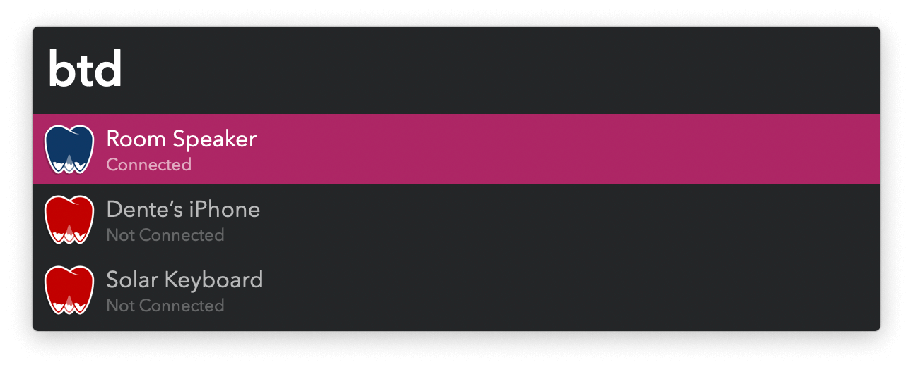
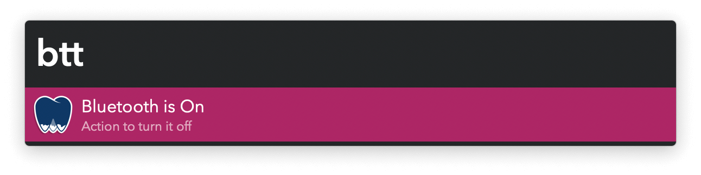

#  Dente Azul Alfred Workflow

Toggle bluetooth paired device connectivity

[⤓ Install on the Alfred Gallery](https://alfred.app/workflows/vitor/dente-azul)

## Usage

Search your paired bluetooth devices via the `btd` keyword.

* <kbd>↩&#xFE0E;</kbd> Toggle connected state.
* <kbd>⇧</kbd><kbd>↩&#xFE0E;</kbd> Ignore device. Restore it from the [Workflow’s Configuration](https://www.alfredapp.com/help/workflows/user-configuration/).

Toggle bluetooth as a whole via the `btt` keyword.

* <kbd>↩&#xFE0E;</kbd> Toggle connected state.
